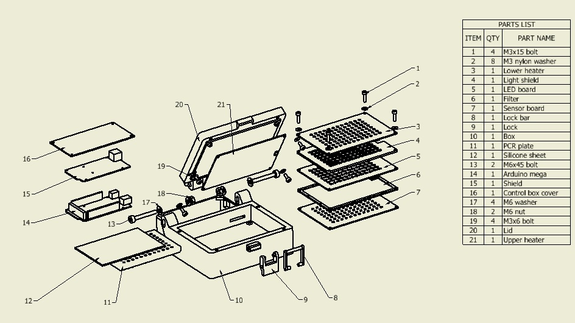
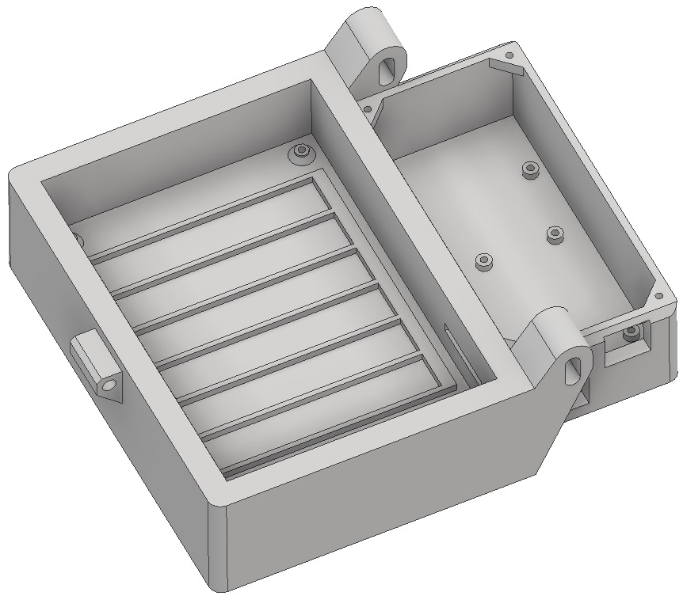
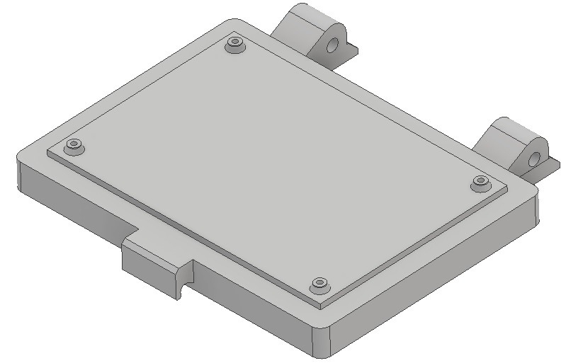

# 3D printable parts

Miriam box is composed of 3D printed parts. It is designed to fit the bed of Prusa i3 mk3 printer.
Printer setting is: PETG with 20% cubic infill, 200% speed.

Exploded view with part list of Miriam. [High resolution version for printing](Miriam_exploded_view.pdf)

## [box.stl](box.stl)

Box is where the mid heating and optic PCBs are located and where the plate to run the assay comes to. It also houses the Arduino Mega and its control shield in the back of the case. 

The outer dimensions of the base are 203 x 173 x 49 mm.

## [lid.stl](lid.stl)

This lid is meant to cover the box and house the upper heating board. The outer dimensions are 165 x 173 x 21 mm.

## [control_cover.stl](control_cover.stl)

Cover is meant to hide the Arduino mega and shield in the back of the case. 

## [filter_holder_bottom.stl](filter_holder_bottom.stl) and [filter_holder_top.stl](filter_holder_top.stl)

Cut the filter and glue it in the middle of these two filters. The bottom one is toward the sensor board.

## [lock.stl](lock.stl) and [lock_bar.stl](lock_bar.stl)

The lock is meant to tighten the lid during testing.

