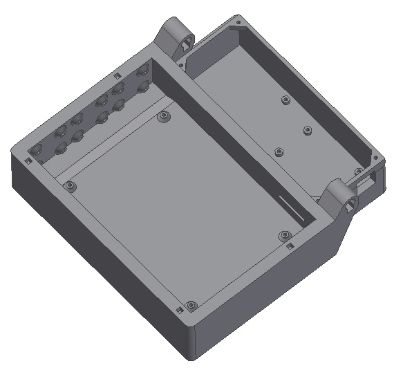
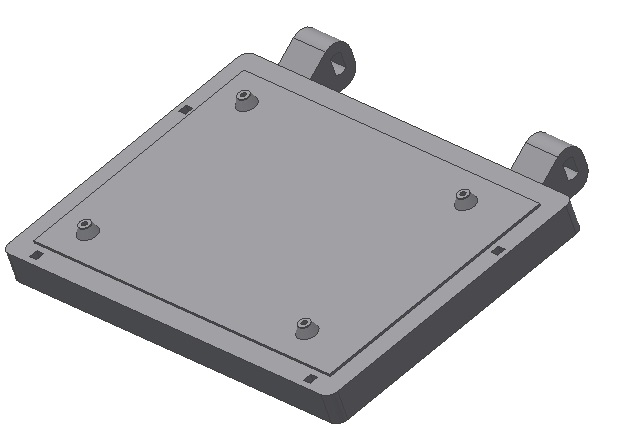
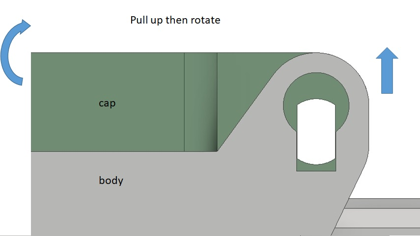

# 3D printable parts

New Miriam box is composed of 3 pieces that can be 3D printed. We decide to change the box design to make it fit to the bed Prusa i3 mk3 printer as well as room for some 30 x 10 mm fans.
Printer setting is: PETG with 20% cubic infill, 200% speed.

## body.stl

Base is where the mid heating and optic PCBs are located and where the plate to run the assay comes to. It also houses the Arduino Mega and its control shield in the back of the case. 

The outer dimensions of the base are 205 x 208 x 64 mm.

## cap.stl 

This is the cover of the case that houses the upper heating board. The outer dimensions are 205 x 165 x 21 mm.

## arduino_cover.stl

Cover is meant to hide the Arduino mega and shield in the back of the case. The dimensions are 164 x 65 x 3.5 mm.

## pin.stl and pin_cap.stl
The pins are meant to connect the cover to the body fo the box. The joint is designed to make it easy to pull the cover fit to the body by embeded magnet. Need to pull the cover up vertically before opening. However, the design need to be improved as it is not straight forward to open the box. Need to get use to it. Can add a simple cam mechanism and a holder to make it easy to open.

