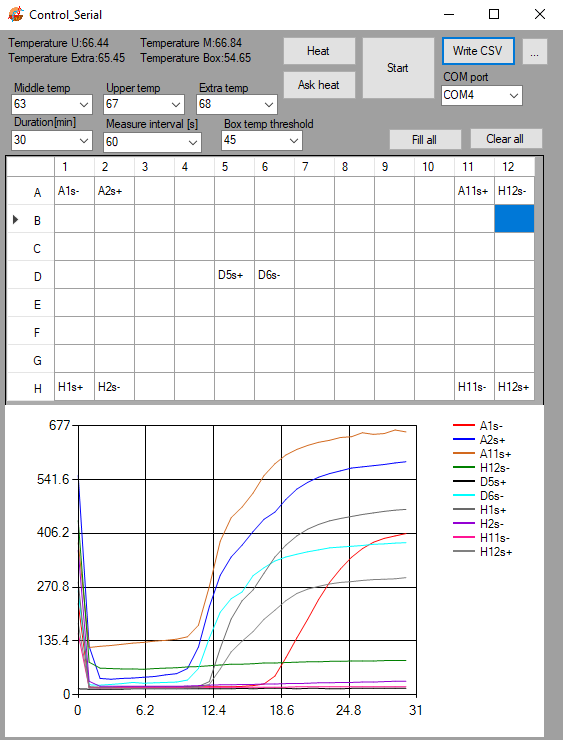

Serial_003
========

This SW / FW combination is meant for serial communication between a computer and Miriam. Miriam is connected with a USB cable to the controlling computer and messaging between the two happen via string messages over RX/TX protocol.
- SW 'R' (read assay) - FW 'A1,A2,A3...E12'
- SW 'i' (info) - FW 'outputMiddle, outputUpper, temperatureMiddle, temperatureUpper, temperatureMiddleC, temperatureUpperC'
- SW 'U param' (upper wanted temperature, i.e. U 80) - FW 'temperatureUpperSet'
- SW 'M param' (middle wanted temperature, i.e. M 63) - FW 'temperatureMiddleSet'
- SW 'C' (cancel, turn off the heat) - FW 'Cancel'

Once the temperature has been set, the actual temperature needs to be refreshed by clicking 'Ask heat'. The assay, once started, can always be turned off simply by closing the program. The assay results are saved to the desktop in a .csv file.

**Figure 1.** User interface of Serial_003.

Temperature U: measured temperature of the upper heater.

Temperature M: measured temperature of the lower heater.

Middle temp: set temperature of the lower heater.

Upper temp: set temperature of the upper heater.

Duration: Total reaction time in minute. After this period, the heaters and sensor readout will stop.

Measure interval: the interval in seconds between two readouts. Minimum value is 11s. For real time measurement, it is recommended to set the interval not lower than 60s as the resistors of the LED board can produce additional heat to the wells in the central collumns. 

COM port: choose your device.

[Heat]: Start heating program.

[Ask heat]: Check the temperature of the heaters and update on the UI.

[Start]: Start the readout cycle as defined by "Duration" and "Measure interval".

[Write CSV]: Save data to CSV.

[...]: Choose folder for saving data.

[Fill all]: Auto name the wells as their positions.

[Clear all]: clear the well name.

**Note:**

The program saves the temperature of the heaters and sensor readouts of all the wells but only plot on the UI those with name filled.

It is recommended to preheat the device at the desired temperature for 30 min before loading the samples.
