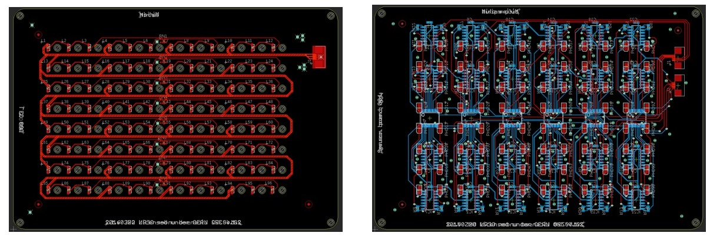

Miriam
========

Miriam is an open-source instrument for isothermal amplification reactions such as LAMP and realtime fluorescence detection. The costs per instrument are below 1000 USD, and our goal is to make it less expensive, more robust, and ready for volume production. It could be used as part of a test for Covid-19 😷. 

**🔥 Update 2020 Oct 15 🔥** Updates are coming. We have built and tested a Miriam device and will be updating this repository with details soon. In the meantime, the new [BOM list](https://docs.google.com/spreadsheets/d/1jToRLCrUTaD4QrNjGMmmIuaWwqO89PiL6eRc0J-1mlM/edit?usp=sharing) of the Covid-19 adapted Miriam is updated constantly during our test.

## User guide ##

View the [Miriam User Guide](https://docs.google.com/document/d/1WqGBbrccB8vQHHecIBe8Pv8aZ-rZUhXWWKjNA4fbFT0/edit?usp=sharing) as a Google Doc. Comments and suggestions are welcome.

## Help wanted

Currently, we are seeking help testing and improving the device. If you have skills circuit board layout, product design, software engineering, user interface design,  and thermal simulation, we could use your help. Furthermore, if you would like to collaborate to put this instrument to real world use, please file an issue or contact [Andrew Straw](<straw@bio.uni-freiburg.de>).

## License

Copyright Miroculus Inc.2016
Based on original work from Arduino (Sweden)

This documentation describes Open Hardware and is licensed under the CERN OHL v. 1.2.

Licensed under CERN OHL v.1.2

You may redistribute and modify this documentation under the terms of the [CERN OHL v.1.2.](http://ohwr.org/cernohl). This documentation is distributed WITHOUT ANY EXPRESS OR IMPLIED WARRANTY, INCLUDING OF MERCHANTABILITY, SATISFACTORY QUALITY AND FITNESS FOR A PARTICULAR PURPOSE. Please see the CERN OHL v.1.2 for applicable conditions

## Introduction

Miriam is optimized for the Syto 9 fluorescent intercalating DNA dye. (The original design was for [calcein dye](http://loopamp.eiken.co.jp/e/products/fluore/index.html). The selected LED is an angle SMD led with peak wavelength 461nm. The photodiode is an RGB photodiode most sensitive to green light. The optics also include an emission filter utilized in theatrical lighting.  The development and selection of components is further described in a [Master's thesis](http://lutpub.lut.fi/handle/10024/159386) done from miriam. 

**Figure 1.** LAMP reaction in 96 well plate. The reaction was performed in the center and corners of the 96 well plate to test heat uniformity.

In the performance testing of Miriam, the detection limit for DNA using LAMP as amplification platform has been 2amol in 10ul of sample (figure 1).

**Figure 2.** LAMP reaction with 2amol DNA input, fluorescence measured every 2 minutes (y, Normalized signal and x, cycle (2 min).

To report an issue, go to the [issues](http://github.com/strawlab/Miriam/issues) section

If you're interested in modifying or extending the Miriam platform, we strongly suggest you to send us an email discussing your ideas. That way you can coordinate with our team and others, giving your work a higher chance of being integrated into the official release.

## Design

The optics of Miriam plus are designed to support Syto9 + DNA. The emission and absorption spectra of Syto9 + DNA are represented in Figure 3.

**Figure 3.** Syto9+DNA emission and excitation spectra.

LEE filter 738 is used for blocking the excitation light. Whole optic design of Miriam plus is shown in Figure 4.

**Figure 4.** Optic design for Miriam plus to detect Syto9 + DNA.

The middle heating board and the LED and PD arrangements have been designed to support 96-well plates with the following dimensions (figure 5).

**Figure 5.** 96-well plate dimensions supported by Miriam

To control the heating of Miriam there are two heater PCBs. They have been designed so that in the middle is a 10 kohm SMD thermistor and the heat is generated by current flowing through the copper traces. These traces have been designed to be so long and narrow that they create an internal resistance of few ohms. The traces are closer to each other in the edges because heat is measured from the middle and the edges of the PCB boards meet ambient air and they need to produce more heat. (Figure 6.)

**Figure 6.** Heating plates, heat is generated by trace resistance. Right: The middle heater creating the temperature required for amplification (58-68 degrees C). Left: The top heater keeping vapor from condensing to the lid, kept at 80 degrees C. 

**Figure 6a.** The distribution of heat in the FR4 and Al heaters. FR4 heaters may work with small number of wells setup. For Miriam, we recommend using Al boards for better heat distribution.

Original Miriam design has 2.5 oC difference in temperature of the central wells and those on the far edge. Adding a heating wire on the edge of the lower heater can improve the uniformity (Fig. 6b). The temperature difference is reduced as low as 1oC or +/-0.5 oC by tuning the heat wire temperature (current) manually. An additional close-loop control for the heating wire would further improve the temperature uniformity.    

**Figure 6b.** Additional heat wire (left) helps to improve heat uniformity of the plate as in thermography images(right).

The heat uniformity of Miriam would be improved further by optimizing the heating traces of the heaters. Using a PCB thermal analysis software (Fig. 6C) with certain protocol for heat trace optimization would help to boost the design process.

**Figure 6c.** Heat distribution of the lower heater obtained from PCB thermal analysis software [(TRM3, ADAM research)](https://www.adam-research.de/en/).

The detection of fluorescence is done with 96 LEDs and 96 photodiodes creating LED and photodiode PCBs. The LED peak wavelength is 470 nm and photodiode is a green RGB photodiode. The measured voltage is amplified with an operational amplifier to 0-5 V that is then converted by Arduino’s 8-bit ADC to be a numerical value. (figure 7.)

**Figure 7.** LED (left) and new photodiode (right) PCBs.

All of these boards are controlled by a shield that is directly mounted to the Arduino mega board (figure 8). The shield contains three MOSFETs to control LED board and the two heater boards, the required components to read the heat from the thermistors as well as a WIFI chip. The WIFI chip makes it possible for Arduino to be connected to a local WIFI and this way communicate autonomously to a web service.

**Figure 8.** The Arduino shield. The power connector is a 20-pin ATX connector that can be connected to a computer ATX power.

Installation
------------
3D print the printable parts under folder "3D model", sand them to make them align with each other. Assemble the boards as presented in the Figure 9. In the assembly cut with scissors the emission filter to fit between the LED and the sensor PCBs so that it aligns with the bolts.

**Figure 9.** PCB board assembly information.

The wiring problem of original sensor board has been fixed in this new version.

**Note:** All the cables used for Miriam must be "Opposite Side Contacts".
          For hand soldering, it is recommended to use solder paste and stencils for the sensor board. If it is possible, use reflow oven for the bottom side.
          
**Updated components:** The new [BOM list](https://docs.google.com/spreadsheets/d/1jToRLCrUTaD4QrNjGMmmIuaWwqO89PiL6eRc0J-1mlM/edit?usp=sharing) of the Covid-19 adapted Miriam will be updated constantly during our test.

Software
------------
We just tested and improved the serial version of the software [Serial_003](https://github.com/strawlab/Miriam/tree/main/Programs/Serial_003).

Improvement wish list
------------
A more robust type of connector can be considered. May change to 1mm pitch. 
Optimization for the traces of lower heater board to have uniformity heat distribution.

Credits
--------
The original Miriam is an open source project, supported by Miroculus in collaboration with Arduino (Sweden). The team was led by Juho Terrijarvi.

This version of Miriam has been improved by [Straw Lab](https://strawlab.org) to make it work with Syto-9 + DNA for potentially Covid-19 test.
Icon and image designed by Miroculus.

The PCB thermal analysis is performed by [ADAM research)](https://www.adam-research.de/en/). 

Code of conduct
--------
Anyone who interacts with this software in any space, including but not limited
to this GitHub repository, must follow our [code of
conduct](code_of_conduct.md).

